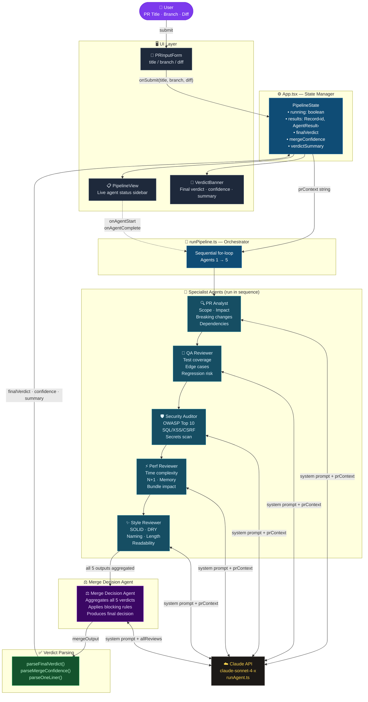
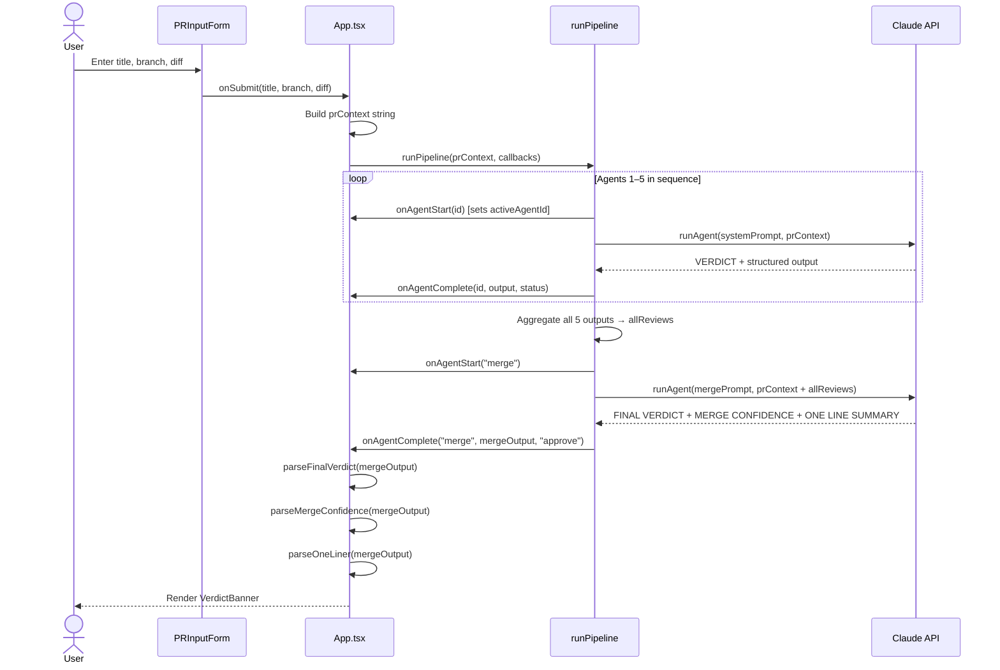
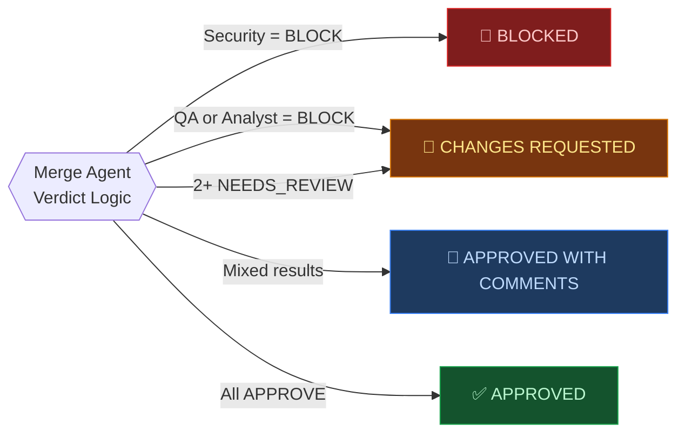
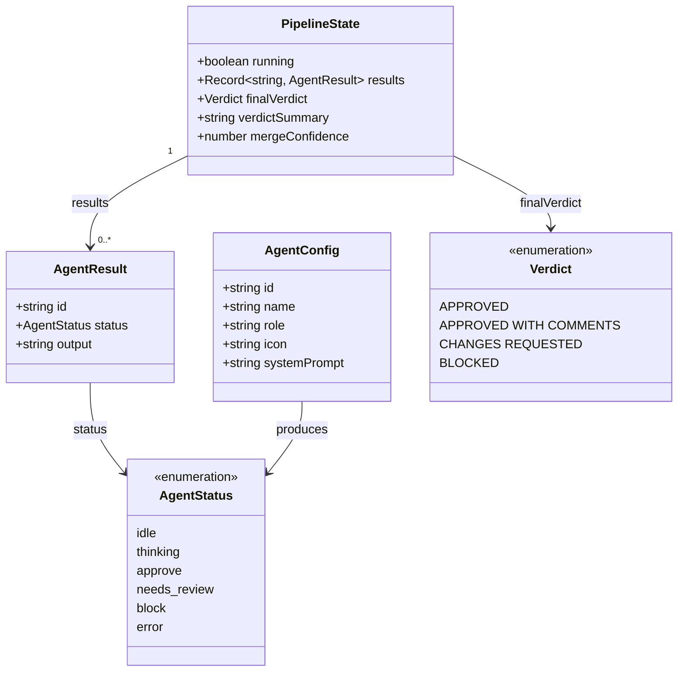

# PR Review Squad — System Design

## Architecture Flow

```mermaid
flowchart TD
    classDef user fill:#7c3aed,stroke:#6d28d9,color:#fff,rx:20
    classDef ui fill:#1e293b,stroke:#475569,color:#e2e8f0
    classDef orchestrator fill:#0f4c75,stroke:#1b6ca8,color:#fff
    classDef agent fill:#164e63,stroke:#0e7490,color:#e0f2fe
    classDef merge fill:#3b0764,stroke:#7e22ce,color:#e9d5ff
    classDef api fill:#1c1917,stroke:#57534e,color:#fcd34d
    classDef verdict fill:#14532d,stroke:#16a34a,color:#bbf7d0

    User(["👤 User\nPR Title · Branch · Diff"]):::user

    subgraph UILayer["  🖥️  UI Layer  "]
        Form["📝 PRInputForm\ntitle / branch / diff"]:::ui
        PV["📋 PipelineView\nLive agent status sidebar"]:::ui
        VB["🏁 VerdictBanner\nFinal verdict · confidence · summary"]:::ui
    end

    subgraph AppLayer["  ⚙️  App.tsx — State Manager  "]
        State["PipelineState\n• running: boolean\n• results: Record‹id, AgentResult›\n• finalVerdict\n• mergeConfidence\n• verdictSummary"]:::orchestrator
    end

    subgraph OrchestratorLayer["  🔄  runPipeline.ts — Orchestrator  "]
        Loop["Sequential for-loop\nAgents 1 → 5"]:::orchestrator
    end

    subgraph AgentLayer["  🤖  Specialist Agents (run in sequence)  "]
        direction LR
        A1["🔍 PR Analyst\nScope · Impact\nBreaking changes\nDependencies"]:::agent
        A2["🧪 QA Reviewer\nTest coverage\nEdge cases\nRegression risk"]:::agent
        A3["🛡️ Security Auditor\nOWASP Top 10\nSQL/XSS/CSRF\nSecrets scan"]:::agent
        A4["⚡ Perf Reviewer\nTime complexity\nN+1 · Memory\nBundle impact"]:::agent
        A5["✨ Style Reviewer\nSOLID · DRY\nNaming · Length\nReadability"]:::agent
    end

    subgraph MergeLayer["  ⚖️  Merge Decision Agent  "]
        MA["⚖️ Merge Decision Agent\nAggregates all 5 verdicts\nApplies blocking rules\nProduces final decision"]:::merge
    end

    ClaudeAPI["☁️ Claude API\nclaude-sonnet-4-x\nrunAgent.ts"]:::api

    subgraph VerdictLayer["  ✅  Verdict Parsing  "]
        VP["parseFinalVerdict()\nparseMergeConfidence()\nparseOneLiner()"]:::verdict
    end

    User -->|"submit"| Form
    Form -->|"onSubmit(title, branch, diff)"| State
    State -->|"prContext string"| Loop
    State --> PV

    Loop --> A1 --> A2 --> A3 --> A4 --> A5

    A1 & A2 & A3 & A4 & A5 <-->|"system prompt + prContext"| ClaudeAPI

    A5 -->|"all 5 outputs aggregated"| MA
    MA <-->|"system prompt + allReviews"| ClaudeAPI

    MA -->|"mergeOutput"| VP
    VP -->|"finalVerdict · confidence · summary"| State
    State --> VB

    PV -.->|"onAgentStart\nonAgentComplete"| Loop
```

---

## Pipeline Sequence

```mermaid
sequenceDiagram
    actor User
    participant Form as PRInputForm
    participant App as App.tsx
    participant Pipeline as runPipeline
    participant Claude as Claude API

    User->>Form: Enter title, branch, diff
    Form->>App: onSubmit(title, branch, diff)
    App->>App: Build prContext string
    App->>Pipeline: runPipeline(prContext, callbacks)

    loop Agents 1–5 in sequence
        Pipeline->>App: onAgentStart(id)  [sets activeAgentId]
        Pipeline->>Claude: runAgent(systemPrompt, prContext)
        Claude-->>Pipeline: VERDICT + structured output
        Pipeline->>App: onAgentComplete(id, output, status)
    end

    Pipeline->>Pipeline: Aggregate all 5 outputs → allReviews
    Pipeline->>App: onAgentStart("merge")
    Pipeline->>Claude: runAgent(mergePrompt, prContext + allReviews)
    Claude-->>Pipeline: FINAL VERDICT + MERGE CONFIDENCE + ONE LINE SUMMARY
    Pipeline->>App: onAgentComplete("merge", mergeOutput, "approve")

    App->>App: parseFinalVerdict(mergeOutput)
    App->>App: parseMergeConfidence(mergeOutput)
    App->>App: parseOneLiner(mergeOutput)
    App-->>User: Render VerdictBanner
```

---

## Agent Verdict Rules

```mermaid
flowchart LR
    classDef block fill:#7f1d1d,stroke:#dc2626,color:#fecaca
    classDef changes fill:#78350f,stroke:#d97706,color:#fde68a
    classDef comments fill:#1e3a5f,stroke:#3b82f6,color:#bfdbfe
    classDef approved fill:#14532d,stroke:#16a34a,color:#bbf7d0

    V{{"Merge Agent\nVerdict Logic"}}

    V -->|"Security = BLOCK"| BL["🚫 BLOCKED"]:::block
    V -->|"QA or Analyst = BLOCK"| CR["🔄 CHANGES REQUESTED"]:::changes
    V -->|"2+ NEEDS_REVIEW"| CR
    V -->|"Mixed results"| AW["💬 APPROVED WITH COMMENTS"]:::comments
    V -->|"All APPROVE"| AP["✅ APPROVED"]:::approved
```

---

## Data Structures

```mermaid
classDiagram
    class PipelineState {
        +boolean running
        +Record~string, AgentResult~ results
        +Verdict finalVerdict
        +string verdictSummary
        +number mergeConfidence
    }

    class AgentResult {
        +string id
        +AgentStatus status
        +string output
    }

    class AgentConfig {
        +string id
        +string name
        +string role
        +string icon
        +string systemPrompt
    }

    class AgentStatus {
        <<enumeration>>
        idle
        thinking
        approve
        needs_review
        block
        error
    }

    class Verdict {
        <<enumeration>>
        APPROVED
        APPROVED WITH COMMENTS
        CHANGES REQUESTED
        BLOCKED
    }

    PipelineState "1" --> "0..*" AgentResult : results
    AgentResult --> AgentStatus : status
    PipelineState --> Verdict : finalVerdict
    AgentConfig --> AgentStatus : produces
```
